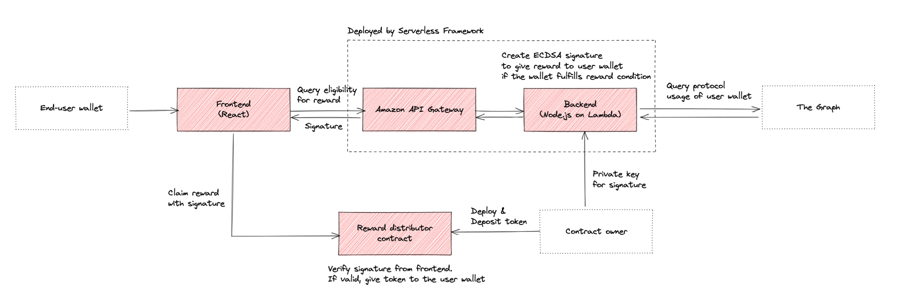

# Stamp rally PoC

## About

This repository is a test project of a stamp rally system in ethereum.

The system offers a "stamp rally campaign" to users:

- A stamp rally consists of multiple steps.
- Each step has a specific goal condition (e.g., Swap ETH in xxx protocol) and reward amount.
- When a user completes each step, he/she can claim corresponding reward.
- Also, it is possible to claim rewards of multiple steps at one time to save gas costs.

## Components

The system consists of the following three components

- Frontend
  - Web UI to show campaigns to users and send requests to backend/contract
- Backend
  - Lambda function to verify how many steps a user completed and to generate a signature of the verification result.
- Reward distributor contract
  - Smart contract to receive reward claim request and to pay reward if the request is valid. The contract uses the signature that backend generates for the validation of the claim. (ECDSA whitelisting)

